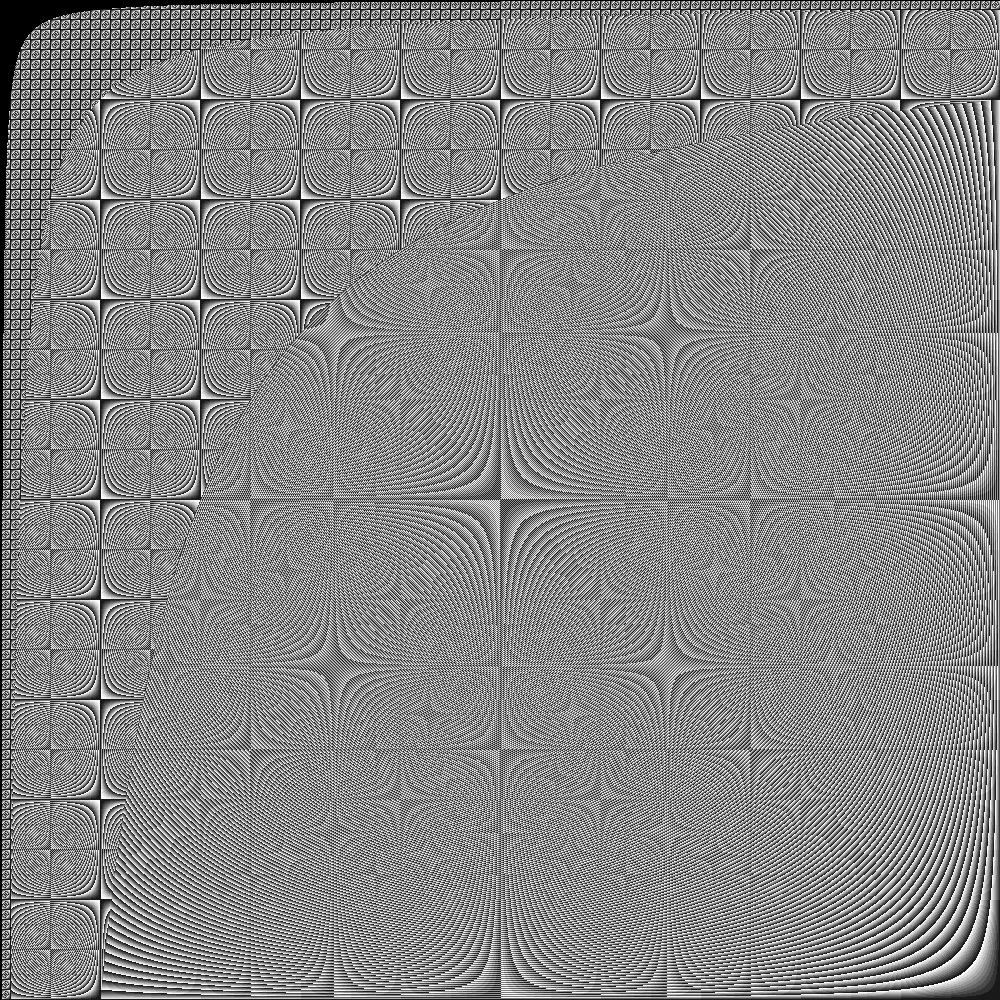
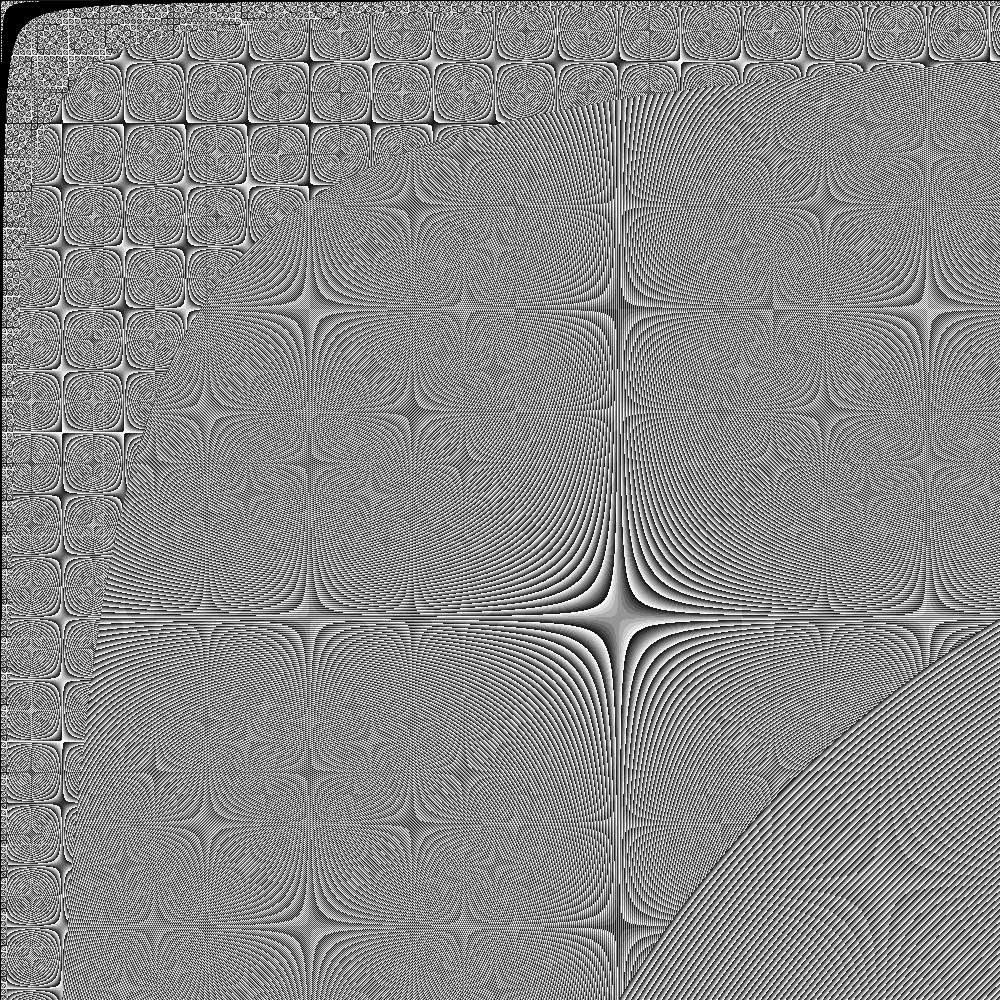
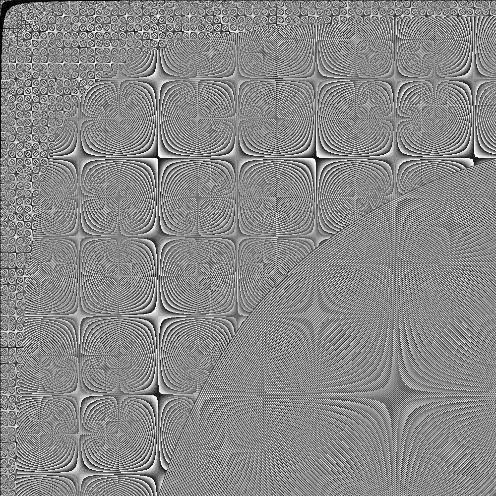
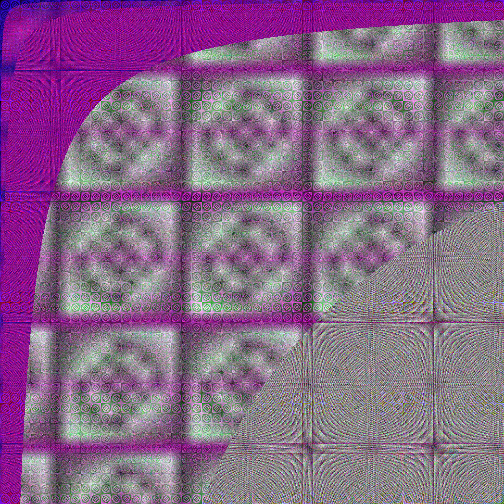
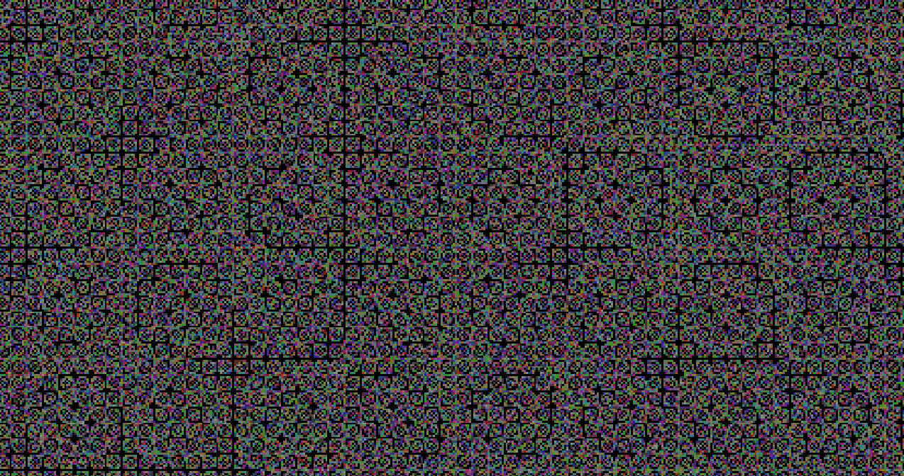
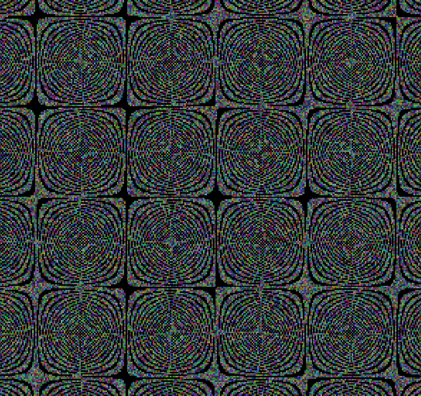
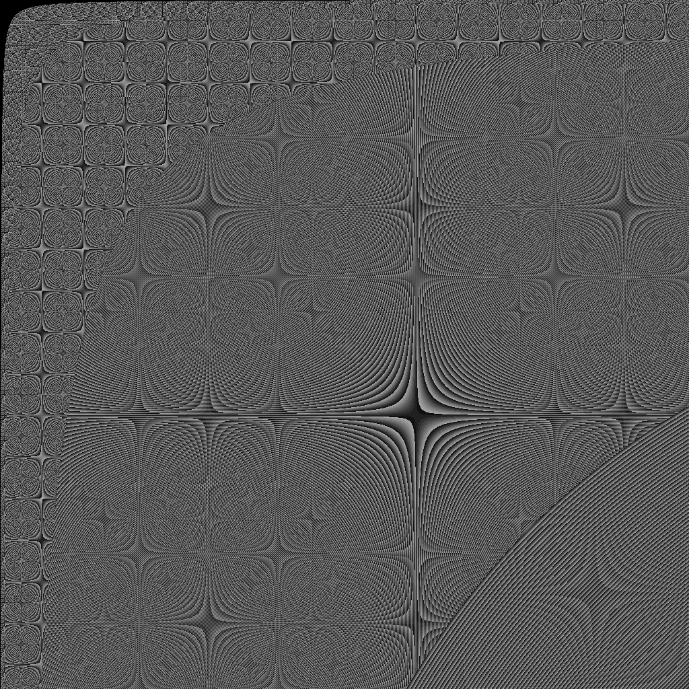
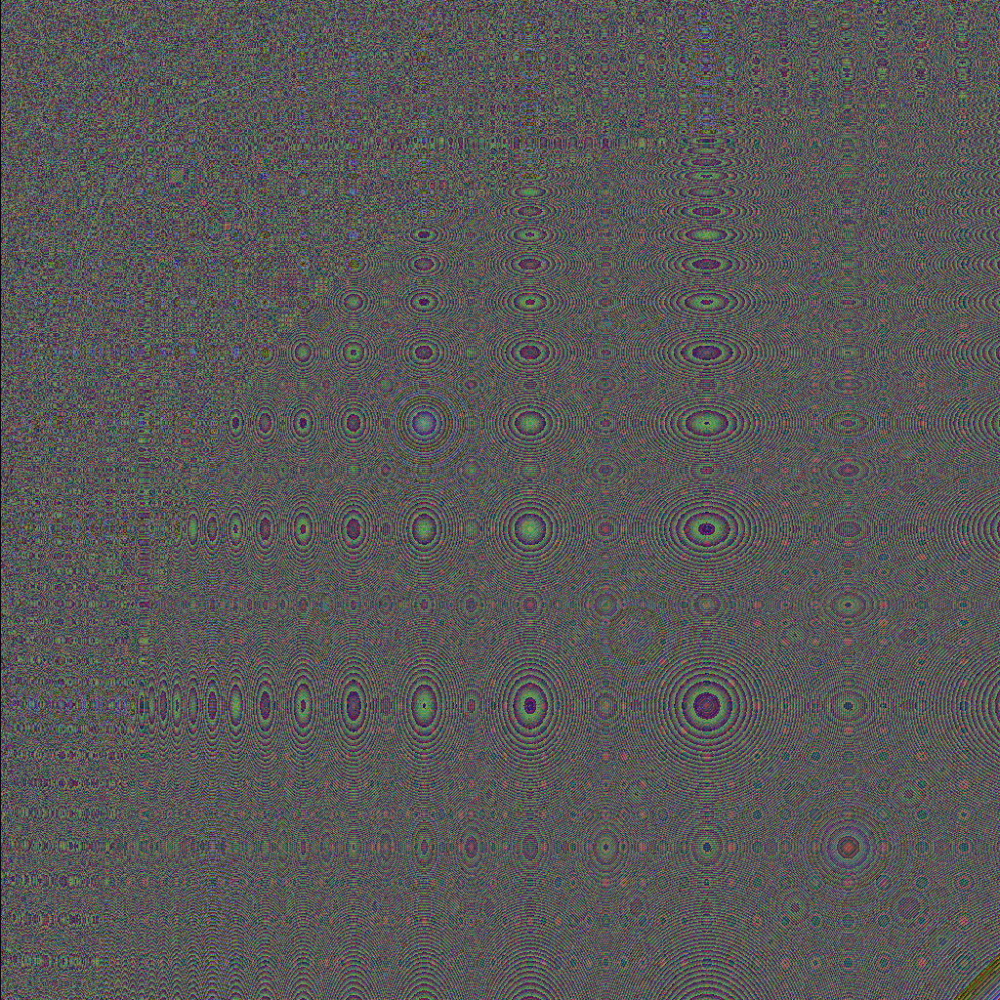
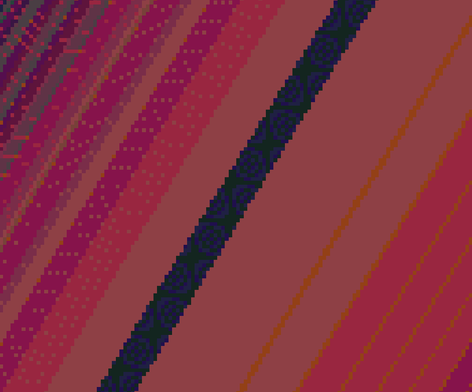

# Image Gallery 


These two images show the difference between iteration using different step sizes. Each image created from the sampled digit at the 4th position.


> Unmodified Step Size; `for step = 1, max_height do`

<a href="./images/modart_4_nc.png"></a>

> Fibonacci Step Size; `for step = 1, (max_height * 1.6180339887499), 1.6180339887499 do`

<a href="./images/modart_4_fibonacci.png"></a>

> Pi Step Size; `for step = 1, (max_height * math.pi), math.pi do`

<a href="./images/modart_4_pi.png"></a>

___

<a href="./images/modart_20250318140911.png"></a>

___

<a href="./images/phivar_20250318002129.png"></a>

___

<a href="./images/phivar_cossin_20250318093417.png"></a>

___

<a href="./images/phivar_adjusted-sample-rate_20250318093558.png"></a>

___

<a href="./images/phivar_20250318081232-3.370269.png"></a>

___

<a href="./images/phivar_20250318031313.png"></a>

___

<a href="./images/phivar_mid_section_closeup_full_color.png"></a>

___

<a href="./images/phivar_mid_section_full_color.png"></a>

> For perspective, the above image was captured from within a 16MP image, highlighted in pink.

<a href="./images/phivar_perspective.png"></a>

___

<a href="./images/phivar_top_band_closeup_full_color.png"></a>

___

<a href="./images/phivar_full-r_half-GB_R3G2B4.png"></a>

> Zooming in on the blue band reveals self-similarity:

<a href="./images/phivar_full-r_half-GB_R3G2B4_closeup.png"></a>

___

```lua

  Images Licensed CC0

-------------------------------------------------------------------------------------
 -- CC0 License                                                                   --
 --                                                                               --
 -- No Copyright                                                                  --
 --                                                                               --
 -- The person who associated a work with this deed has dedicated the work to the --
 -- public domain by waiving all of his or her rights to the work worldwide under --
 -- copyright law, including all related and neighboring rights, to the extent    --
 -- allowed by law.                                                               --
 --                                                                               --
 -- You can copy, modify, distribute and perform the work, even for commercial    --
 -- purposes, all without asking permission. See Other Information below.         --
 --                                                                               --
 -- In no way are the patent or trademark rights of any person affected by CC0,   --
 -- nor are the rights that other persons may have in the work or in how          --
 -- the work is used, such as publicity or privacy rights.                        --
 --                                                                               --
 -- Unless expressly stated otherwise, the person who associated a work with      --
 -- this deed makes no warranties about the work, and disclaims liability for     --
 -- all uses of the work, to the fullest extent permitted by applicable law.      --
 --                                                                               --
 -- When using or citing the work, you should not imply endorsement by            --
 -- the author or the affirmer.                                                   --
-------------------------------------------------------------------------------------
```

<!-- <a href="./"></a> -->