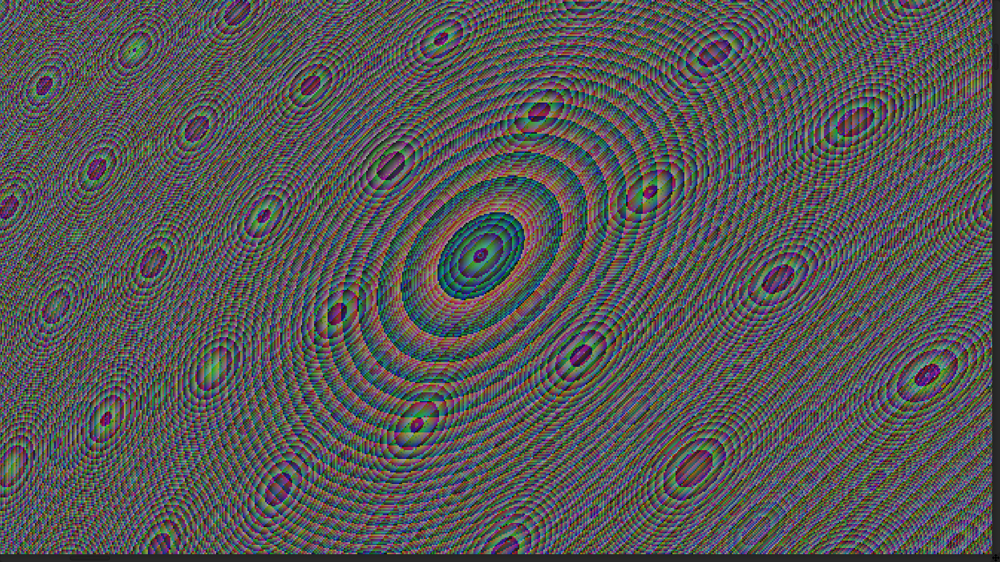
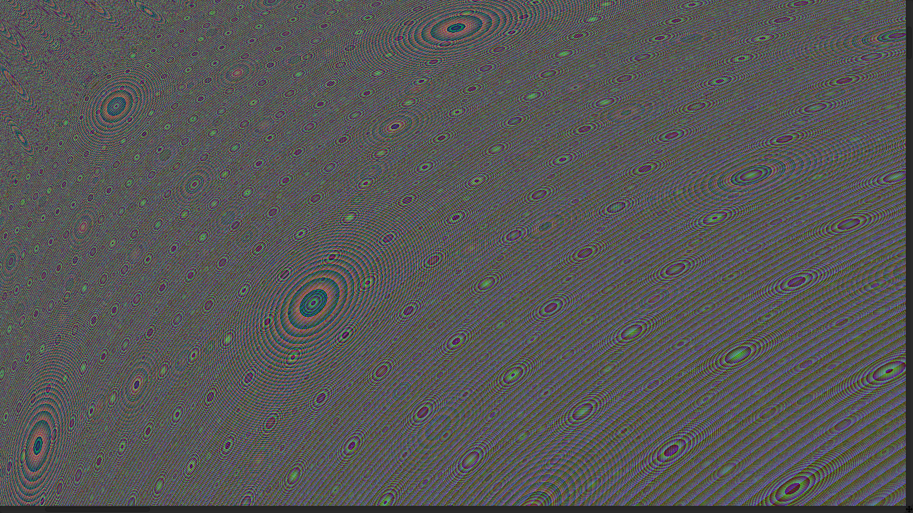
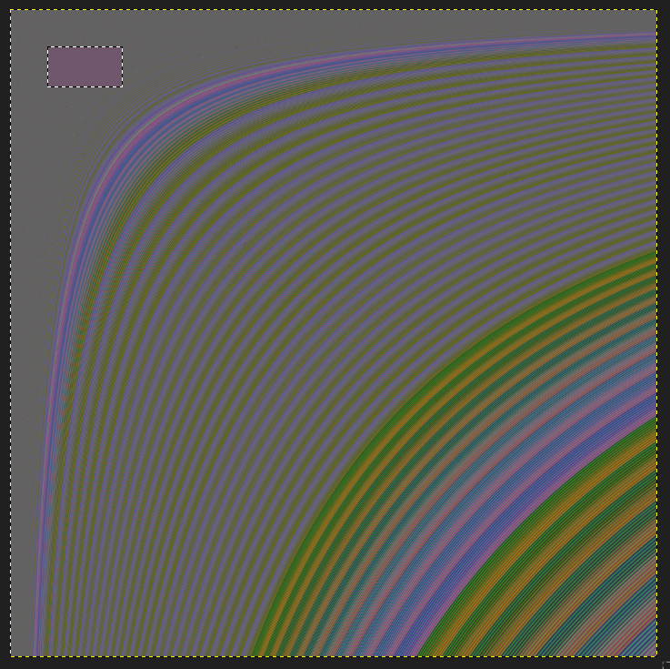
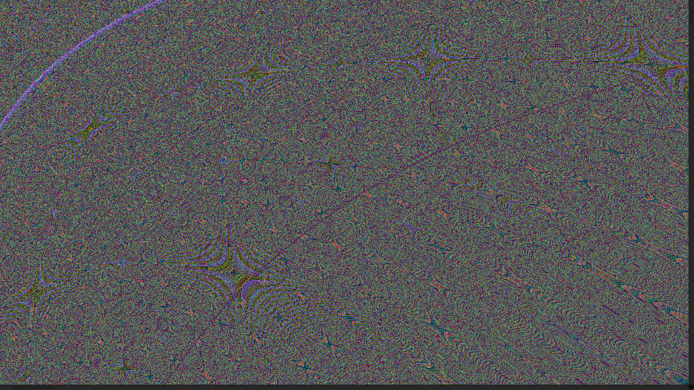

# Image Gallery 

For reference, 'RGB code' describes Nth digit of the product of `phi_variance(n)`.

Eg;
  - `R-3`: Red is using `n:sub(-3,-3)`; that is, third digit from end
  - `B2`: Blue is using `n:sub(2, 2)`; second digit from beginning

If the color was adjusted, it will be noted. Otherwise, images are generated with a linear color scheme, where black is 

___

## The eyes, `(R-3,G-2,B-4)`

<a href="./images/phivar_mid_section_closeup_full_color.png"></a>

<a href="./images/phivar_mid_section_full_color.png"></a>

> For perspective, the above image was captured from within a 16MP image, highlighted in pink.

<a href="./images/phivar_perspective.png"></a>


## Banded Stars, `(R-3,G-2,B-4)`

<a href="./images/phivar_top_band_closeup_full_color.png"></a>

## Full Red, Half Green, Half Blue, `(R-3,G-2,B-4)`

<a href="./images/phivar_full-r_half-GB_R3G2B4.png"></a>


```lua

  Images Licensed CC0

-------------------------------------------------------------------------------------
 -- CC0 License                                                                   --
 --                                                                               --
 -- No Copyright                                                                  --
 --                                                                               --
 -- The person who associated a work with this deed has dedicated the work to the --
 -- public domain by waiving all of his or her rights to the work worldwide under --
 -- copyright law, including all related and neighboring rights, to the extent    --
 -- allowed by law.                                                               --
 --                                                                               --
 -- You can copy, modify, distribute and perform the work, even for commercial    --
 -- purposes, all without asking permission. See Other Information below.         --
 --                                                                               --
 -- In no way are the patent or trademark rights of any person affected by CC0,   --
 -- nor are the rights that other persons may have in the work or in how          --
 -- the work is used, such as publicity or privacy rights.                        --
 --                                                                               --
 -- Unless expressly stated otherwise, the person who associated a work with      --
 -- this deed makes no warranties about the work, and disclaims liability for     --
 -- all uses of the work, to the fullest extent permitted by applicable law.      --
 --                                                                               --
 -- When using or citing the work, you should not imply endorsement by            --
 -- the author or the affirmer.                                                   --
-------------------------------------------------------------------------------------
```

<!-- <a href="./"></a> -->