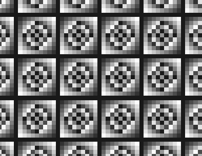
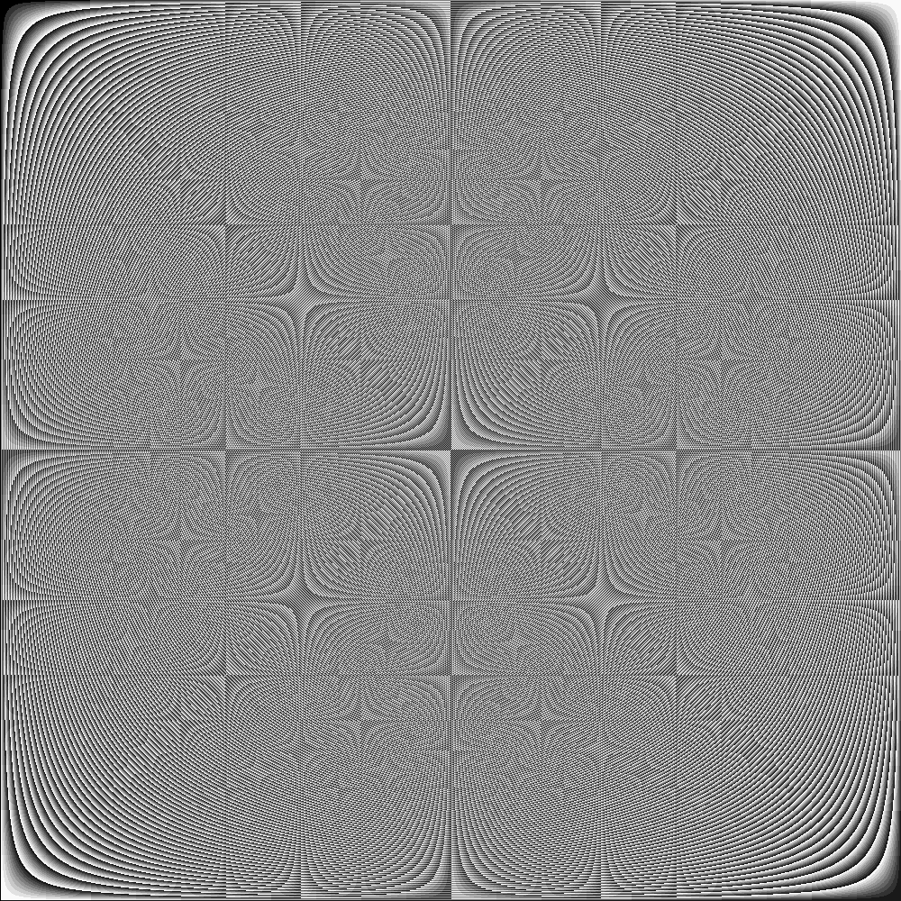
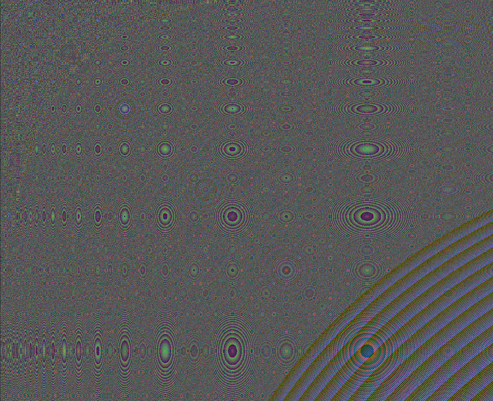
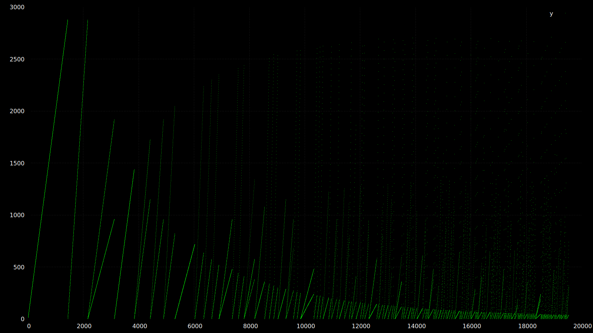

# Modular Sampling of Incremental Step Size

We have discovered the underlying cause of the patterns observed in this repository are directly related to the method of sampling the data.

Removed from all calculation, sampling via sequential pattern from numbers appearing in a sequence is inevitably going to create patterns. This is quite obvious now in hindsight.

The sample method uses an incremental step size, which is `(N + 1) + N`.

Using a nested loop, we increment the step size with the outer loop, and the inner loop takes the steps for sampling.

Each sampled digit will create a uniqe frequency. For example, sampling the last digit produces:



And sampling the third from last position creates:



An example of the differences between each sample position can be seen here: [sample positions](./images/sample_position/README.md)

Applying various mathematical formulas will influence the images generated. Some do not, or the correct parameters haven't been found. For example, using a cosine wave funcion on the modular sampling requires a sample rate of 0.01 to produce an image with visual details, otherwise it is indistinguishable from static noise.

Phi Variance: `abs(log10((n + √(n + 1)) / (n + 2)))`


Additional images will be added to the [Gallery](/GALLERY.md)

___

## How to

Run init.lua from terminal with parameters:

> `$ lua init.lua w=1024 h=1024 r=1 g=2 b=-3

Options are:

```
  --help        Show the help message
  --height, -h  The height of the image in pixels
  --width, -w   The width of the image in pixels
  -r, -g, -b    Changes the position of the sampled digit of the RGB map
```

The r, g, and b parameters select the position of the digit being sampled, and in turn changes the color of the pixel of its corresponding channel. Negative numbers will select from the end (right), and positive argument will select from the start (left). For example:

```
Red channel, 3rd from end, r=-3
  123423453456
           ^
Green channel, 4th from start, g=4
  123423453456
     ^
Blue channel, 2nd from end, b=-2
  123423453456
            ^
```

Images generated can be found in `images/new/`, and will be in `.ppm` format.

___
___

Previous Research and Experimentation:

___

## Log10

A slight adjustment was made to the original Phi variant function:

```lua
  local function phi_variant(n)
    local n = math_abs(math_log10(n + math_sqrt(n + 1)) / 2 + n)
    local i = n % 1
    return n - i * i
  end
```

And instead of occurrences of 0.5, we now sample all values:

```lua
  local n = phi_variant(n)
    table_insert(colors, {
        string_sub(tostring(n), -3, -3),
        string_sub(tostring(n), -2, -2),
        string_sub(tostring(n), -1, -1)
    })
```

To elaborate, if phi_variant = 1234.56789, then we capture 7, 8, 9.

The captured numbers become index keys from a RGB map to render the images.

```lua
  local function phi_variant(n)
    local n = abs(log10(n + sqrt(n + 1)) / 2 + n)
    local i = n % 1
    return n-i * i
  end
```

this function, which increments `n` during a loop, is the phi golden formula with incremental values in the square and division part. 
the log10 is applied and then absolute value.
`n % 1` gets the decimal from `n`, then we substract it from `n` and multiply by `n`

in the inner loop, 

```lua
  local n = phi_variant(n)
  if n then
    local nchar = tostring(n)
    insert(color_keys, {
        sub(nchar, -3, -3),
        sub(nchar, -2, -2),
        sub(nchar, -4, -4)
    })
  end
```

after retreiving the value of `n`, we use sub to pick the digit of `n` of the sub(). In Lua indexes start at 1, so `-2` is the second from last digit.
These digits each represent an RGB color, for each row is R or G or B respectively.
To colorize the pixel, the gradient map is:

```lua
  for n = 9,0,-1 do
    local c = 16 * (n+1)
    rgb_map[tostring(n)] = c
  end
```
This gives us 10 colors. The digit of each row become a colored pixel.


___
___

## Initial curiosity and observations:

### Frequency of x.5 depends on step size

By increasing the step size (Z) of (n), x.5 can be found at different intervals.

- When Z = n + 1: `y = (y + 2)`
- When Z = n + 2: `y = (y + 4)`
- When Z = n + 3: `y = (y * 2 + 2) ω (y / 2 + 1)`
  - alternates between the (y) values of (Z = 2) and (Z = 1)
- When Z = 4: `y = (y + 2)`
- When Z = 5, or 6, or 7, the pattern of y is:
  - "alternating between adding 4 and 6 to the number before the current position"

```
Z:6 n:48  x:75.5   y:4
Z:6 n:120 x:185.5  y:12 -- add 4 to previous number
Z:6 n:168 x:258.5  y:8  -- add 6 to previous number
Z:6 n:288 x:440.5  y:20 -- add 4 to previous number
Z:6 n:360 x:549.5  y:12 -- etc
Z:6 n:528 x:803.5  y:28
Z:6 n:624 x:948.5  y:16
Z:6 n:840 x:1274.5 y:36
```

- When Z = 8, `y = (y + 1)`
- When Z = 9, the pattern of y is similar to 5,6, and 7, instead alternating between 4 and 14.



___

## Serial Palindromes

From each appearance of x.5, we isolate the last integer of n (Ln), then add it to the series of it's step size.

- example:
  - if `x = 1234.5` and `n = 320`, then `Ln = 0`

We can now map the series of Ln to a grid, where the rows are step_size and columns are the steps between x.5

Multiple numerical palindromes are found virtually anywhere in the grid, some also containing "meta-palindromes"

  Example output of Ln:
```
    0385458309038545830903854583090385458309038545830903854583090385458309038545830
    0848008480084800848008480084800848008480084800848008480084800848008480084800848
    0354839085580938453003548390855809384530035483908558093845300354839085580938453
```

Wanting to visualize the pattern, we create a gradient color scheme and assign each number to a color.

The image produces creates an "multiplicative cascading" image along symmetric verical axes.

[Generated from 9217 different step sizes](images/last_of_n_long.png)

___

## Deviation from symmetry.

At line 1785, the first instance of asymmetry can be seen (when using a width of 80):

`09944444999994444449999944444999999444449999944444499999444449999994444499999444`

These asymmetrical numbers will increase in occurrence as the step size increases.

It is unclear why this happens, or whether it eventually regains stereoscopy.