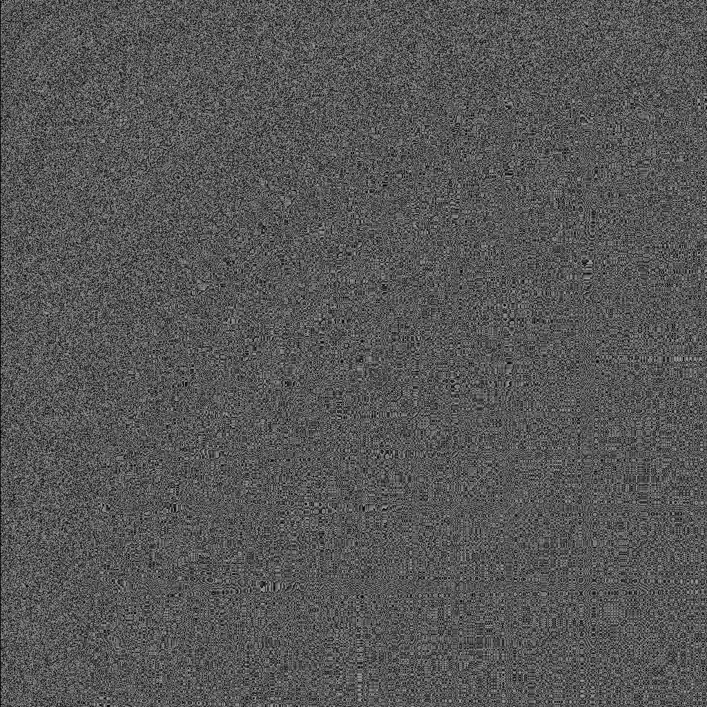

# Sampled Digit Position

Below are examples of the images produced by sampling different positional digits.

Starting from Left, position 1, through 14, the last digit of each product of:

```lua
  local function phi_variant(n)
    local n = abs(log10(n + sqrt(n + 1)) / 2 + n)
    return tostring(n):gsub("%D", "")
  end
```

> pos 1


> pos 2


> pos 3


> pos 4


> pos 5


> pos 6


> pos 7


> pos 8


> pos 9


> pos 10


> pos 11


> pos 12


> pos 13


> pos 14


